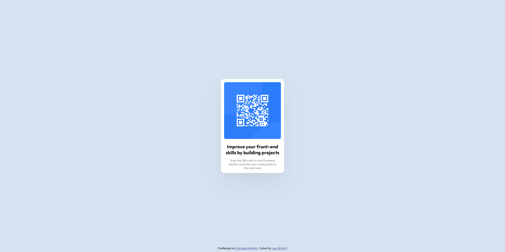

# Frontend Mentor - QR code component solution

This is a solution to the [QR code component challenge on Frontend Mentor](https://www.frontendmentor.io/challenges/qr-code-component-iux_sIO_H). Frontend Mentor challenges help you improve your coding skills by building realistic projects. 

## Table of contents

- [Overview](#overview)
  - [Screenshot](#screenshot)
  - [Links](#links)
- [My process](#my-process)
  - [Built with](#built-with)
  - [Continued development](#continued-development)
- [Author](#author)
- [Acknowledgements](#acknowledgments)

## Overview

### Screenshot

### Links

- Solution URL: [Frontend Mentor](https://www.frontendmentor.io/solutions/qr-code-component-with-responsive-design-for-desktop-and-smartphones-MX2NBCvhFr)
- Live Site URL: [GitHub Pages](https://law973.github.io/qr-code-component/)

## My process

### Built with

- Semantic HTML5 markup
- Flexbox
- CSS Grid
- Responsive design (for desktop and smartphones)

### Continued development

I want to get better at creating elements that respond to changes in the viewport width and viewport height, and at making responsive 
layouts via Flexbox and Grid.

## Author

- Website - [Levi Wright](https://luxury-flan-09fd6a.netlify.app/)
- Frontend Mentor - [@law973](https://www.frontendmentor.io/profile/law973)
- LinkedIn - [Levi Wright](https://www.linkedin.com/in/levi-arthur-wright/)
- GitHub - [@law973](https://github.com/law973)

## Acknowledgements

I would like to thank Zero to Mastery for providing a course on CSS (The CSS Bootcamp) that covers responsive design.
